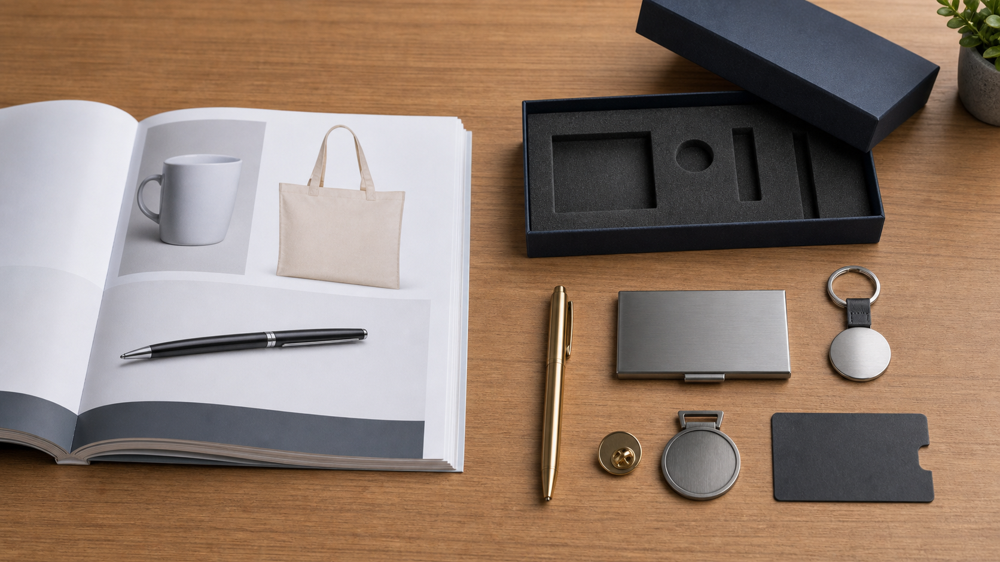
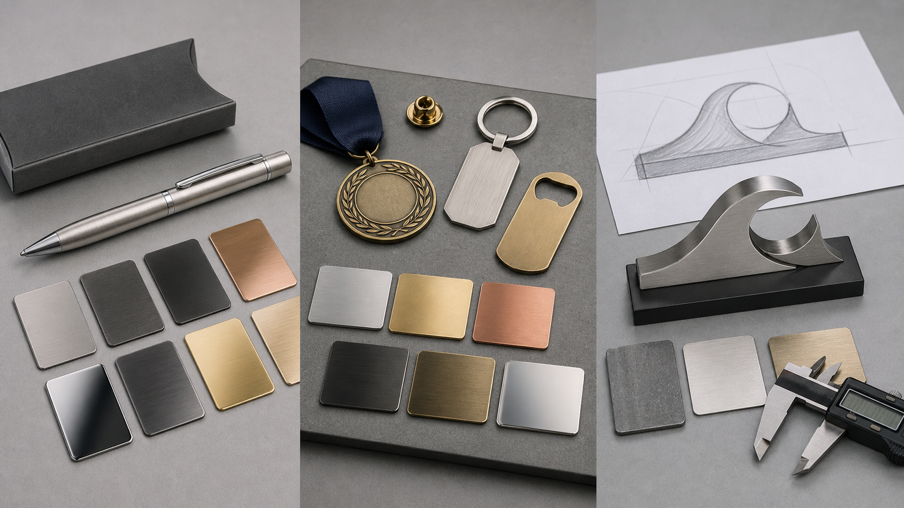
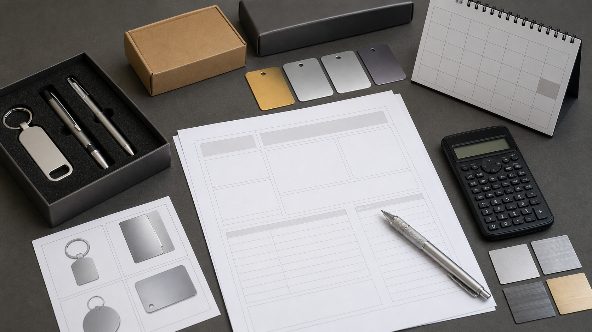

# From Standard Catalogue to Custom Metal Projects: When Promo Distributors Should Go Off-Catalogue

**Slug:** standard-catalogue-to-custom-metal-projects  
**Category:** Distributor Strategy  
**Read time:** 7 min read  
**Target keyword:** custom promotional products beyond catalog  
**Secondary keywords:** custom metal promotional gifts / off-catalogue custom sourcing / promotional products distributor custom sourcing / custom promotional products beyond catalogue

---

**Meta Title**

When Promo Distributors Should Go Off-Catalogue

**Meta Description**

Learn when standard catalogue products are enough and when promo distributors should consider off-catalogue custom metal gifts for planned client projects.

---

**Quick Answer**

Off-catalogue custom sourcing is useful when a standard promotional product SKU is too generic for the client brief. For promo distributors, it usually means adapting a proven product family, creating a semi-custom item, or developing a planned custom gift project with clearer material, packaging, budget, and timeline requirements.

---

Standard catalogues, or catalogs in North American terminology, are still the backbone of the promotional products industry. For everyday logo orders, rush events, repeat apparel jobs, basic drinkware, and simple giveaways, catalogue sourcing is usually the fastest and lowest-risk option.

Platforms such as ASI and SAGE exist because distributors need speed, range, supplier comparison, and repeatable ordering. ASI gives distributors access to over a million brandable products through ESP, while SAGE supports promotional product research, presentations, supplier search, and project workflows. That catalogue workflow is not going away.

But some client briefs do not fit neatly inside a standard SKU search.

A client may not want "another pen," "another mug," or "another tumbler." They may need a gift for a service award, executive event, client appreciation program, sponsor package, or milestone campaign. In those moments, the question is not only "what product can we logo?" It becomes: **what can we adapt, package, or develop so the item feels specific to this brand moment?**

That is where off-catalogue custom metal projects can make sense.

## What "Off-Catalogue" Means

There is no single formal definition of "off-catalogue" across the promotional products industry. In practice, it usually means moving beyond a standard catalogue SKU with a logo added.

A practical definition is:

> Off-catalogue custom sourcing means modifying, combining, sourcing, or developing a product option that is not simply a standard catalogue item with standard branding.

It does not always mean creating a product from zero.

| Level | What It Means | Example | Typical Feasibility |
|---|---|---|---|
| Catalogue-adjacent | A proven product family, adapted for a project | Metal pen with custom finish, packaging, insert card, or set combination | Usually straightforward |
| Semi-custom | A familiar product type made for a specific brief | Custom metal keychain, medal, pin, bottle opener, tag, or keepsake | Often feasible with a clear brief |
| Fully bespoke | A new product shape, tooling, or structure | Custom-shaped desk piece, commemorative object, or campaign-specific metal item | Case-by-case review |

For most distributor projects, off-catalogue does not need to start at the fully bespoke level. It often means taking a proven metal product family and adapting the material, finish, logo method, packaging, or gift-set structure around a client brief.

## When the Catalogue Is Still the Better Route

A standard catalogue product is usually the better choice when speed, low unit cost, and proven repeatability matter most.

That includes many rush events, broad handouts, basic apparel orders, simple drinkware, tote bags, lanyards, and low-cost logo products. These are exactly the kinds of jobs where a distributor's existing ASI, SAGE, ESP, PPPC, or local supplier workflow is supposed to work well.

The mistake is not using catalogue products. The mistake is forcing a catalogue product into a brief that is asking for something more specific, more memorable, or more gift-like.

## When Distributors Should Consider Going Off-Catalogue

A custom metal project may be worth exploring when the client says things like:

- "We want something different this year."
- "This is for our top clients."
- "It needs to feel more premium."
- "We want something people will keep."
- "Can it match our event theme?"
- "We do not want the usual giveaway item."

These are not normal commodity-order signals. They are project signals.

[PPAI's Product Power 2026 research](https://www.ppai.org/media-hub/product-power-2026-what-consumers-want-next-2/) points in the same direction: recipients respond better when branded merchandise feels useful, relevant, well-designed, and emotionally connected to the moment. PPAI's distributor data also shows why wider sourcing conversations are now normal: 61% of U.S. distributors sourced direct from overseas manufacturers in 2024, up from 47% in 2022, according to [PPAI's 2024 U.S. Distributor Sales Volume Report](https://www.ppai.org/wp-content/uploads/2025/02/2024-PPAI-Sales-Volume-Report.pdf).

That does not mean every distributor should abandon their catalogue suppliers. It means some briefs require a wider sourcing lane.

## Why Metal Works Well for Off-Catalogue Projects

Metal is useful in off-catalogue projects because it changes the feel of the item.

Compared with many lightweight giveaway products, metal can offer:

- Weight and permanence
- Strong perceived value
- Better fit for recognition and milestone moments
- More controlled branding through engraving, debossing, plating, or subtle logo placement
- Good compatibility with premium packaging
- A wide range of formats: pens, keychains, medals, pins, card cases, desk pieces, bottle openers, drinkware, and custom-shaped keepsakes

A pen, for example, can be a cheap giveaway. But a brass pen in a structured box with restrained branding and a matching desk accessory becomes a different kind of object. The product category is familiar, but the presentation changes the meaning.

Off-catalogue projects can also help distributors move away from highly transparent commodity pricing. When the product, packaging, finish, and presentation are built around a brief, the conversation becomes less about matching the cheapest SKU and more about delivering a higher-perceived-value package.

The best distributor strategy is not choosing between catalogue and custom sourcing. It is knowing when a brief needs speed and repeatability, and when it needs a more specific material, finish, packaging structure, or gift experience.

## Catalogue or Custom Metal? A Decision Checklist

Not every brief needs an off-catalogue solution. Use this checklist before moving into a custom metal quote.

| Question | Standard Catalogue Is Usually Better When... | Custom Metal May Be Worth Exploring When... |
|---|---|---|
| How urgent is the timeline? | The item needs to be confirmed or delivered within days. | The project has enough time for artwork, proofing, production, and shipping. |
| What is the main goal? | Low unit cost, high quantity, or quick distribution. | Higher perceived value, retention, recognition, or a more memorable brand moment. |
| Does the client want something different? | A regular logo product is enough. | The client asks for a specific shape, material, finish, packaging, or set combination. |
| Who will receive it? | It is a broad handout for a large audience. | It is for selected clients, employees, sponsors, speakers, members, or VIPs. |
| How should the brand appear? | Standard logo visibility is enough. | The client wants more restrained, premium, or theme-specific branding. |
| How much uncertainty can the client accept? | They want a proven SKU, fast sampling, and low uncertainty. | They can review mockups or proofs and accept a planned development process. |

If most answers fall on the left, a standard catalogue product is probably the better route. If several answers fall on the right, the project may justify off-catalogue custom sourcing.

## What to Include in a Custom Metal Gift Brief

Once a project looks suitable for custom sourcing, the next step is not to ask for a vague quote. A useful brief helps the supplier judge feasibility, cost, production time, and the right level of customization.

At minimum, clarify:

- **Project purpose:** recognition, event, onboarding, client appreciation, retail-style merch, sponsor gift, or another use case.
- **Recipient profile:** employees, top clients, speakers, sponsors, members, customers, or VIP guests.
- **Quantity:** expected order quantity, plus whether there may be repeat orders.
- **Target budget:** per piece or per set, including any distributor margin expectations and whether packaging is included.
- **Deadline:** required delivery date, event date, and whether the date is flexible.
- **Product format:** single item, paired items, or a full gift set.

Then add the technical details that shape the quote:

- **Material / finish / branding:** brass, stainless steel, aluminium, zinc alloy, titanium; engraving, printing, enamel, plating, PVD, brushed finish, polished finish, sandblasting, precision CNC details, or discreet logo placement where the project justifies it.
- **Packaging / approval / documents / shipping:** gift box, insert card, sleeve, proofing process, material declarations, labeling, testing expectations, destination country, and delivery address type.

You do not need perfect 3D engineering drawings to start the conversation. A concept, target budget, use case, and preferred direction are enough for an initial feasibility review. More detailed artwork, mockups, or production drawings can come later if the project is a fit.

## Where Wischos Fits

Wischos Gift is a China-based B2B exporter of custom metal corporate gifts, working with planned projects such as metal pens, desk pieces, EDC items, drinkware, pins, medals, custom-shaped metal pieces, and gift sets.

For distributors, this kind of supplier is best used as a planned-project source, not as a replacement for daily local catalogue supply. The fit is strongest when a standard catalogue item feels too generic and the client has enough time to develop something more specific.

Typical fit:

- MOQ around 100 sets
- Production lead time around 25-35 days
- Strongest fit for catalogue-adjacent and semi-custom metal projects; fully bespoke tooling needs case-by-case review

Seasonal timing matters. For Q4 and year-end gifting, many buyers plan delivery 90-120 days ahead. That planning window is much more compatible with custom metal production than last-minute holiday buying.

## Example Project Scenarios

**Employee recognition:**  
A brass pen, custom metal badge, or desk piece packaged for service anniversaries or promotion milestones.

**Executive client appreciation:**  
A metal pen and desk accessory set with restrained branding and structured gift packaging.

**Brewery or hospitality VIP gift:**  
A custom metal opener, tag, coaster, or drinkware piece designed around the venue or campaign.

**Conference sponsor gift:**  
A slim metal card case, pen, or custom-shaped keepsake for speakers, sponsors, or VIP attendees.

**Awards and milestone programs:**  
Custom medals, pins, challenge-coin-style pieces, or small metal objects that feel more permanent than a standard giveaway.

## Conclusion

Standard catalogues are essential. They help distributors quote quickly, compare options, manage repeat orders, and serve everyday promotional needs.

Off-catalogue custom projects have a different role. They are for moments when the client wants the item to feel more specific, more durable, more gift-like, or more connected to the campaign.

The strongest distributor strategy is not catalogue or custom. It is knowing when each one fits.

If a client brief calls for a planned custom gift beyond standard catalogue items, the next step is to clarify the brief before asking for a quote: purpose, recipient, quantity, budget, timeline, material direction, packaging, and approval path.

## FAQ

### What does off-catalogue mean in promotional products?

Off-catalogue means moving beyond a standard promotional product SKU with a logo added. In practice, it can include adapting a proven product family, combining items into a custom set, sourcing a product not shown in the standard catalogue, or developing a semi-custom item for a specific client brief.

### When should a promo distributor use a custom metal gift instead of a catalogue item?

A custom metal gift is worth exploring when the client wants stronger perceived value, retention, recognition impact, specific materials, custom packaging, or a more memorable brand moment. Standard catalogue sourcing is usually better for rush orders, low-cost mass handouts, basic apparel, and simple repeatable logo items.

### What information is needed for a custom metal gift quote?

A useful custom metal gift brief should include project purpose, recipient profile, quantity, target budget, deadline, product format, preferred material or finish, branding method, packaging expectations, approval process, destination country, and any compliance or documentation requirements.

### Can off-catalogue suppliers replace local catalogue suppliers?

Usually, no. Off-catalogue suppliers are best used for planned custom projects that need a specific material, finish, packaging structure, or product format. Local catalogue suppliers remain the better route for rush fulfilment, apparel decoration, repeat SKU orders, and very low-cost mass giveaway sourcing.

## Have a Brief That Feels Too Generic for the Catalogue?

Send your concept, target budget, quantity, and deadline to `inquiries@wischosgift.com`. We can review whether the project is a realistic fit for a catalogue-adjacent, semi-custom, or fully bespoke metal gift approach before you commit to a quote path.

## Related Reading

- [What Makes a Corporate Gift Worth Keeping?](https://wischosgift.com/blog/what-makes-a-corporate-gift-worth-keeping)
- [Surface Finishes for Metal Corporate Gifts](https://wischosgift.com/blog/metal-surface-finishes-corporate-gifts)

## Sources

- PPAI Product Power 2026: https://www.ppai.org/media-hub/product-power-2026-what-consumers-want-next-2/
- PPAI 2024 U.S. Distributor Sales Volume Report: https://www.ppai.org/wp-content/uploads/2025/02/2024-PPAI-Sales-Volume-Report.pdf
- ASI ESP platform: https://asicentral.com/
- SAGE: https://www.sageworld.com/
